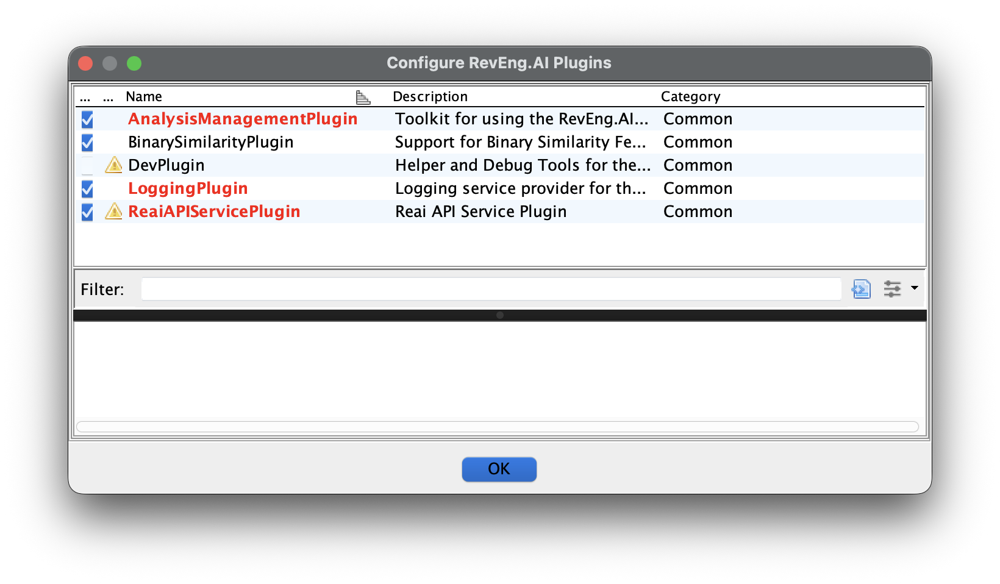
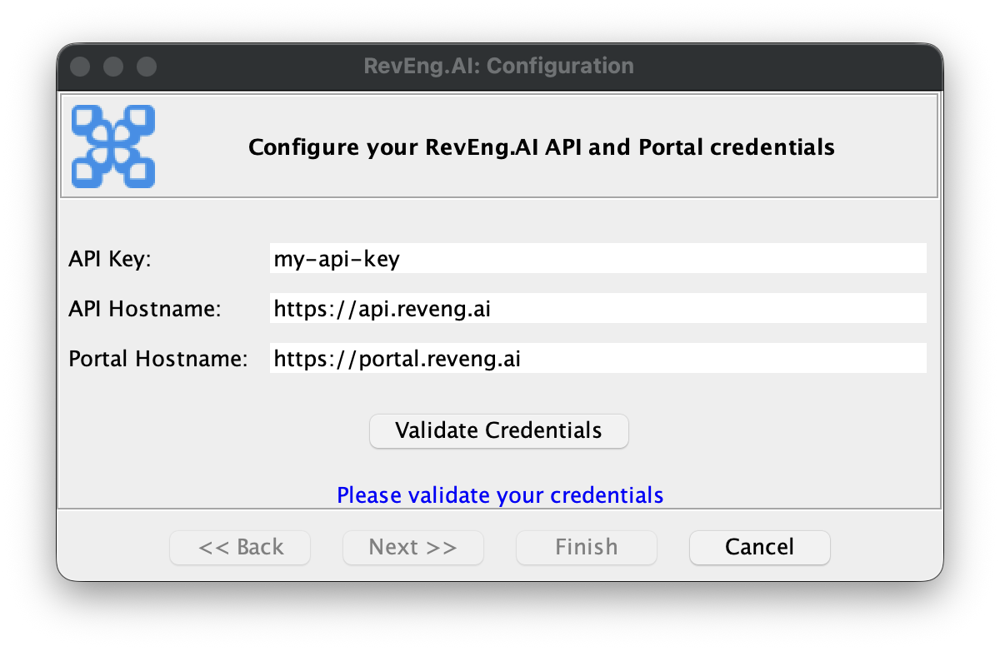
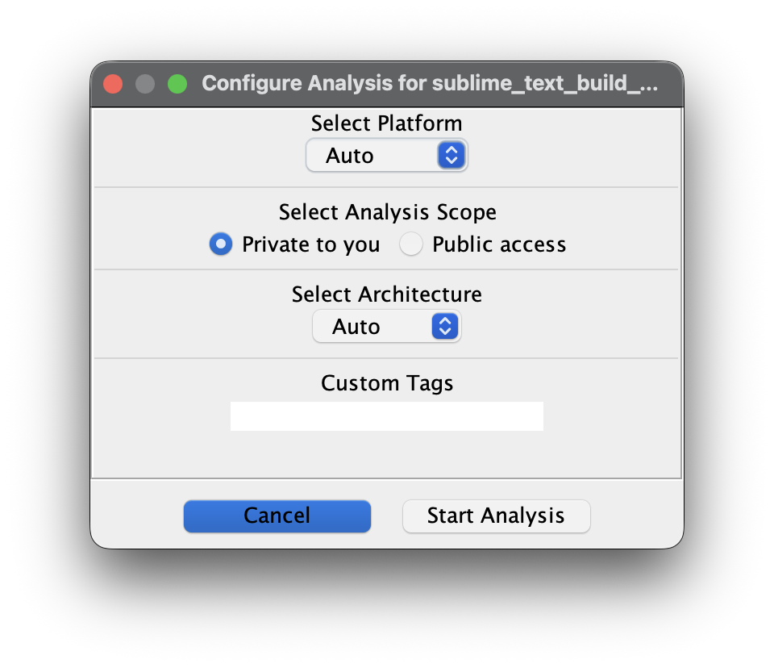
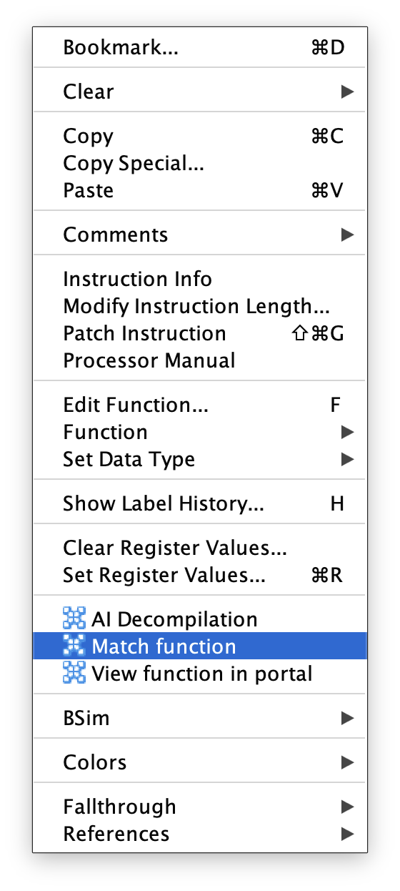
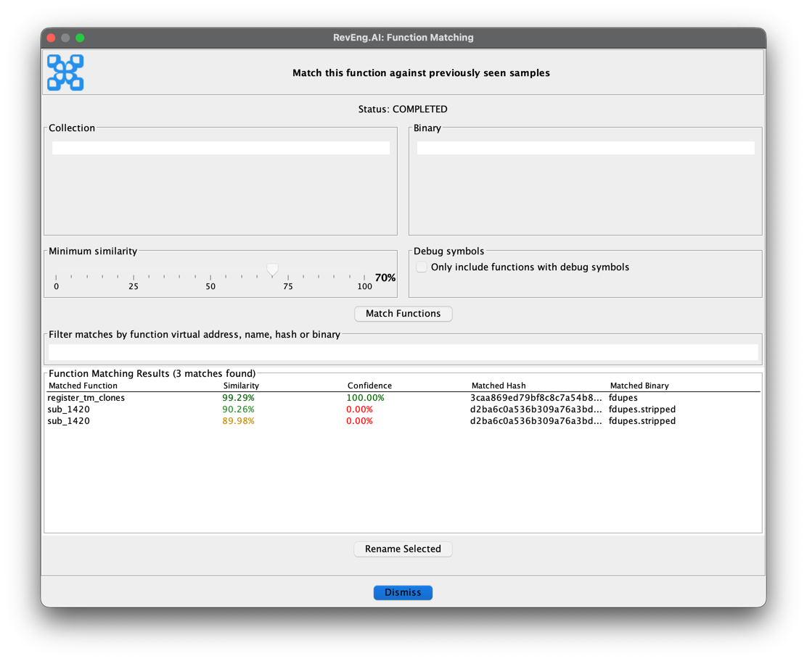
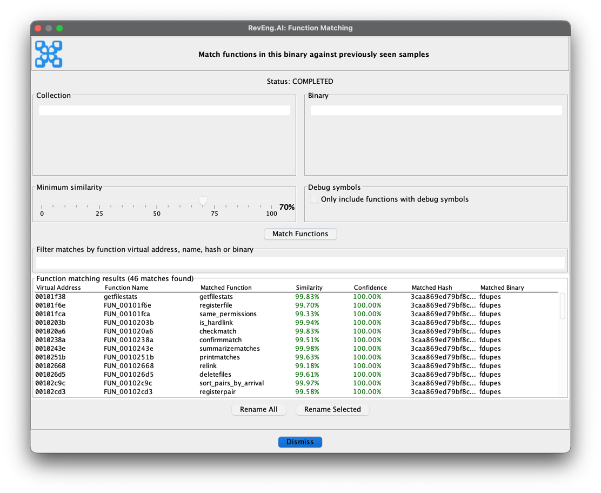
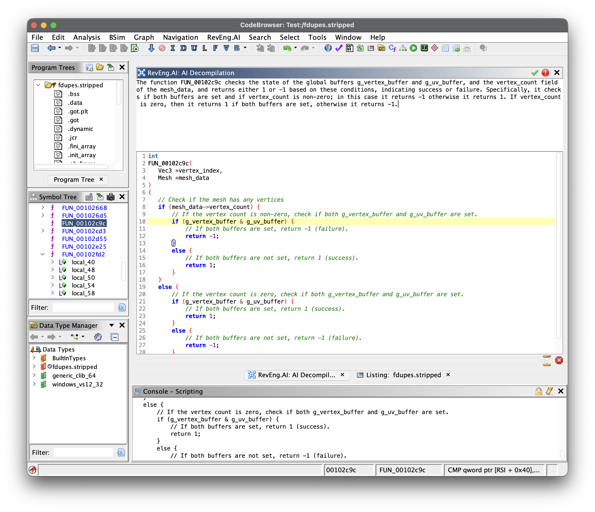

# RevEng.AI Ghidra Plugin

[Discord](https://discord.com/invite/ZwQTvzfSbA)

### AI Assisted Binary Analysis

Released as open source by RevEng.ai - https://reveng.ai

<!-- TODO -->
<!-- Released under the Apache 2.0 license (see [LICENSE](LICENSE) for more information) -->

## Description

The RevEng.AI Ghidra plugins allows you to interact with our API from within Ghidra.
This allows you to upload your currently open binary for analysis,
and use it for Binary Code Similarity to help you Reverse Engineer stripped binaries.

## Table of contents

- [Key Features](#key-features)
- [Installation](#installation)
  - [Loading the Plugin](#loading-the-plugin)
  - [Enabling the Plugin](#enabling-the-plugin)
- [Usage](#usage)
  - [Configuration](#configuration)
  - [Analysis](#analysis)
  - [Auto Unstrip](#auto-unstrip)
  - [Function Matching](#function-matching)
    - [Individual function matching and renaming](#individual-function-matching-and-renaming)
    - [Batch function matching and renaming](#batch-function-matching-and-renaming)
  - [AI Decompilation](#ai-decompilation)
- [Contributing](#contributing)
  - [Building from Source](#building-from-source)
  - [Reporting Bugs](#reporting-bugs)
    - [Known Issues](#known-issues)

## Key features

* Upload the current binary for analysis
* Automatically rename all functions above a confidence threshold
* Show similar functions and their names for one selected function

## Installation

The builds for latest stable version of the RevEng.AI Ghidra plugin for common Ghidra versions can be downloaded from the [Releases](https://github.com/revengai/reai-ghidra/releases/latest) page.

### Supported Ghidra versions

We support all versions compatible with Ghidra 11.2+ based on Java 21.

#### Building your own plugin (for custom Ghidra forks and versions)

If you are using a custom version of Ghidra (e.g. nightly builds), then you need to build your own version of the plugin against it,
otherwise Ghidra complains about a version mismatch when trying to install the plugin.
You can do this via `./gradlew -PGHIDRA_INSTALL_DIR=/opt/ghidra buildExtension`, and then use the zip from the `dist/` folder.

### Loading the plugin

1. Launch Ghidra.
2. Navigate to the `Install Extensions` window.
   * `File` -> `Install Extensions...`
3. Click the green "+" icon in the top-right corner.
4. Select the downloaded ZIP file to load the plugin into Ghidra.
5. Click the "OK" button to exit the `Install Extensions` window.
6. Restart Ghidra when prompted.

### Enabling the plugin

Once installed, you can enable the plugin via the `Configure` tool.

1. Navigate to Ghidra's Configure tool
   - `File` -> `Configure`
2. Click `Configure` under the `RevEng.AI` plugin group
3. Select the checkbox next to each of the plugins except the `DevPlugin` (unless you are doing development on the plugin itself)



## Usage

In this section, we provide an example workflow for our plugin that uses test binaries from `src/test/resources`.

Once the plugin is loaded, there will be additional menu entries in the toolbar under `RevEng.AI`.

### Configuration

The first thing we need to do is configure the plugin with our API key and the host to use.

When you load the plugin for the first time, or by selecting `RevEng.AI -> Configure`, you will be guided through the configuration process.



> Enter your API Key from the [RevEng.AI Portal](https://portal.reveng.ai/settings) into the API Key field
> where they will be validated and saved for future use.


### Analysis

You are now ready to analyse a binary.

Import `src/test/resources/fdupes` into Ghidra and then create a new RevEng analysis, by going to `RevEng.AI -> Analysis -> Create New`.
Usually it's enough to use the default options, but you can also select specific platforms or architectures if you want to.



> We are using `fdupes` with symbols to allow the model to learn what these functions look like, and to provide meaningful labels that we can use later to rename similar binaries.

You can check the status of your request by selecting `RevEng.AI -> Analysis -> Check status` from the same menu.
Starting an analysis also triggers a background Ghidra thread that will periodically check the status
and pop a notification when the analysis is complete.

### Auto Unstrip

The `Auto Unstrip` tool allows you to automatically recover function names based on our debug symbol database. It is 
an automated process that will recover all function names from the currently attached binary.

You can access it by selecting `RevEng.AI -> Auto Unstrip` from the menu.

### Function Matching

The function matching tool allows you to rename functions in a binary based on similarity to functions in our database.
It is a manual process that can be done on a per-function basis, or in batch mode for the entire binary. It allows you 
to have more control over which functions are renamed, and when as well as the ability to review the suggested names before
applying them.

#### Individual function matching and renaming

We now have uploaded `fdupes` to our dataset, meaning we can now use it for our binary similarity tasks. Let's see how this works on a stripped version of `fdupes`.

Import `src/test/resourcesfdupes.stripped` using the same steps as before. Once this has been completed, you can move on to the next step.

With `fdupes.stripped` open in Ghidra, select a function in Ghidra's listing or decompiler view, and `Right-Click -> Match function`.
This will open the function matching and renaming window.      




Adjust the filters as necessary and when ready click `Match Functions`. This will return up to 10 functions that match
the selected function. You can then decide to rename the function to one of the suggested names by clicking `Rename Selected`.

You can always update the filters and click `Match Functions` again to update the returned functions based on updated filters.

#### Batch function matching and renaming

You can also batch analyse the binary to rename functions using the `Function Matching` tool. You can access it by 
selecting `RevEng.AI -> Function Matching` from the menu.



Similar to the individual function matching window, you can adjust the filters as necessary.
When ready, click `Match Functions` to start the matching process. Once you get the results back you can either
rename all the functions or select specific functions to rename.

### AI Decompilation

The `AI Decompilation` tool allows you to get AI generated decompilation of selected functions. You can access it by
right-clicking on a function in Ghidra's listing or decompiler view and selecting `AI Decompilation`.

The window will show you the AI generated decompilation of the selected function as well as a
natural language explanation of what the function does.

The window can be pinned and will update as you select different functions in Ghidra.



## Contributing

We welcome pull requests from the community.

The plugin is still undergoing active development currently, and we are looking for feedback on how to improve it.


### Code Overview

We have tried to decompose the plugin into a series of individual plugins dependent on a **CorePlugin**.

The **CorePlugin** provides services that are shared across all parts of the toolkit, namely configuration and API Services.

You should therefore group related features into a Feature Plugin, and then acquire services from the CorePlugin as required. This gives users the flexiblity to enable / disable features based on their use-case and/or preferences.

### Building from source

Gradle can be used to build the plugin from its source code.

#### No Eclipse

1. Clone the GitHub repository.
   ```
   git clone https://github.com/RevEngAI/reai-ghidra.git
   ```

2. Enter the repository and build with gradle.
   ```
   cd reai-ghidra
   gradle -PGHIDRA_INSTALL_DIR=<ghidra_install_dir>
   ```
   * Replace `<ghidra_install_dir>` with the path to your local Ghidra installation path.

3. After building, the plugin ZIP file will be located in the `dist/` folder.

#### Using Eclipse

Developing in Eclipse is the prefered method, but it does require some setup on the developers part, below is a (non-exhaustive) summary of what you need to do.

1. Import the project into Eclipse
2. Under **Preferences -> Gradle**
   - Add a Program Argument: `-PGHIDRA_INSTALL_DIR=PATH2GHIDRA`
3. Link you project with Ghidra using GhidraDev
4. Update your classpath to point at `jar`'s in `lib/`
   - Again this can be found in your project `preferences`

### Reporting Bugs

If you've found a bug in the plugin, please open an issue via [GitHub](https://github.com/RevEngAi/reai-ghidra/issues/new/choose), or create a post on our [Discord](https://discord.com/invite/ZwQTvzfSbA).

#### Known Issues

_Plugin configuration is not appearing after installation:_

Check that the downloaded folder is called `reai-ghidra` and not `reai-ghidra-2` due to multiple downloads of the same folder.
