# RevEng.AI Ghidra Plugin

[Video Overview](https://vimeo.com/867118159)

### AI Assisted Binary Analysis

Released as open source by RevEng.ai - https://reveng.ai

<!-- TODO -->
<!-- Released under the Apache 2.0 license (see [LICENSE](LICENSE) for more information) -->


## Description

The RevEng.AI Toolkit allows you to interact with our API from within Ghidra. This allows you to upload your currently open binary for analysis, and use it for Binary Code Simularity to help you Reverse Engineer stripped binaries.

## Table of Contents

- [Key Features](#key-features)
- [Installation](#installation)
  - [Loading the Plugin](#loading-the-plugin)
  - [Enabling the Plugin](#enabling-the-plugin)
- [Usage](#usage)
   - [Auto Analysis](#auto-analysis)
   - [Function Explaination](#function-explaination)
- [Contributing](#contributing)
  - [Building from Source](#building-from-source)
  - [Reporting Bugs](#reporting-bugs)
    - [Known Issues](#known-issues)
- [Credits](#credits)

## Key Features

* Upload the current binary for analysis
* Rename a function based on similar functions from our dataset
* Ask for a human readable function explanation

## Installation

The latest stable version of the RevEng.AI Toolkit for Ghidra can be downloaded from the [Releases](https://github.com/revengai/reait-ghidra/releases/latest) page.

### Loading the Plugin

1. Launch Ghidra.
2. Navigate to the Install Extensions window.
   * `File` -> `Install Extensions...`
3. Click the green "+" icon at the top-right corner.
4. Select the downloaded ZIP file to load the plugin into Ghidra.
5. Click the "OK" button to exit the Install Extensions window.
6. Restart Ghidra when prompted.

### Enabling the Plugin

Once installed, you can enable the plugin via the `Configure` tool.

1. Navigate to Ghidra's Configure tool
   - `File` -> `Configure`
2. Click `Configure` under the `RevEng.AI` plugin group
3. Select the checkbox next to each of the plugins you want to enable

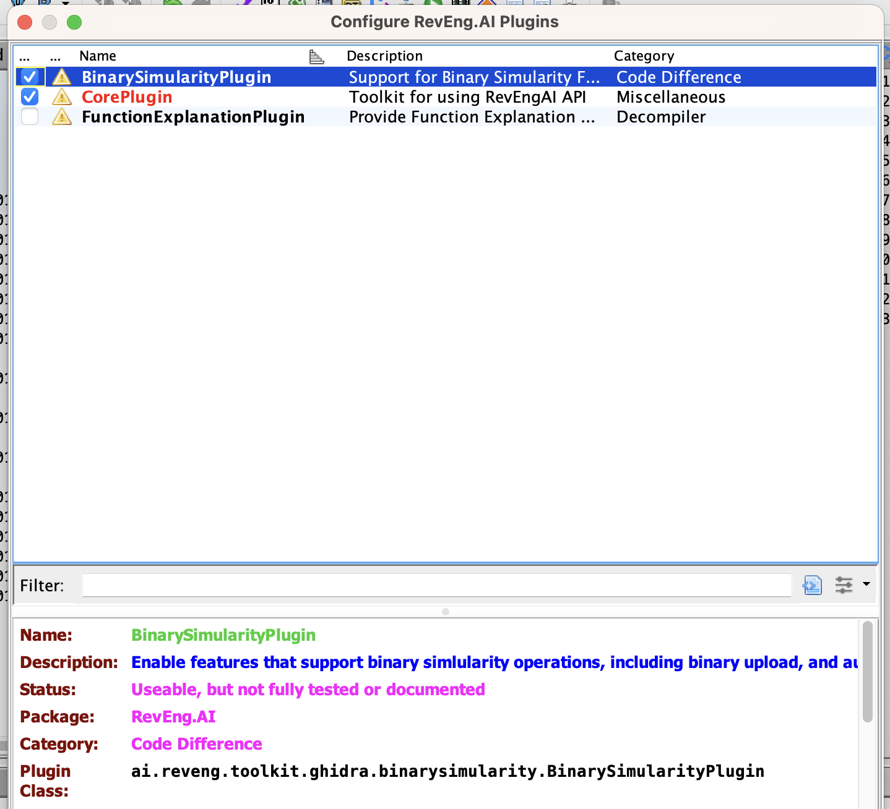

Each plugin is dependent on the `CorePlugin`, for instance, by enabling the `BinarySimularityPlugin` you will automatically enable the `CorePlugin`.

## Usage

In this section, we provide an example workflow for our plugin that uses test binaries from `src/test/resources`.

Once the plugin is loaded, there will be additional controls in the toolbar under `RevEngAI Toolkit`.

The first thing we need to do is configure the tool with our API key and the desired "model".
- Each **model** defines a different set of features you want the AI to find in you binary.

When you load the plugin for the first time, or by selecting `RevEngAI -> Run Setup Wizard`, you will be guided through the configuration process.

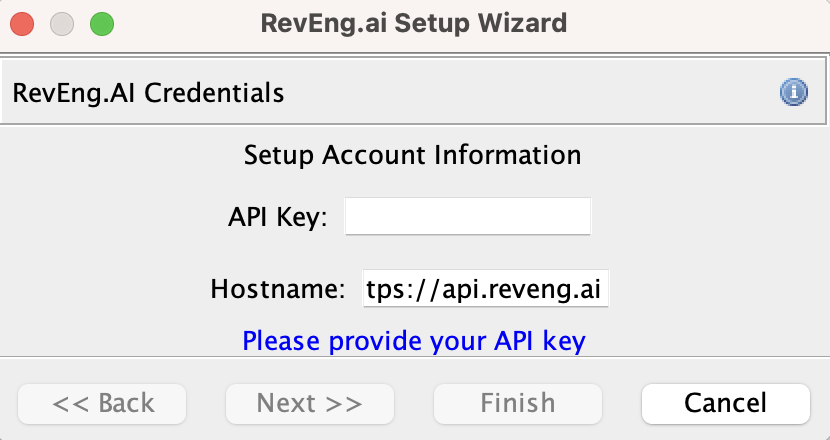

> Enter your API Key from the [RevEng.AI Portal](https://portal.reveng.ai/settings) into the API Key field which will enable the next button.
> This will contact the API and display a list of models available to your account.
> Select the model that you want to use and click finish

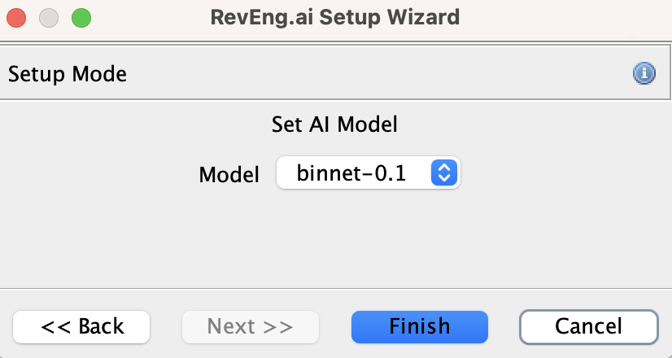

You are now ready to upload a binary.

Import `src/test/resources/fdupes` into Ghidra and then click `Upload`, either by going `RevEngAI Toolkit -> Upload Binary`, or by right-clicking in the listing view and selecting `Upload Binary`

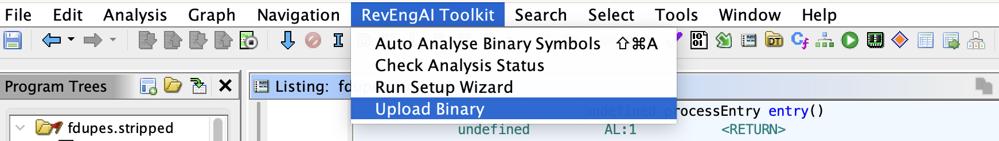

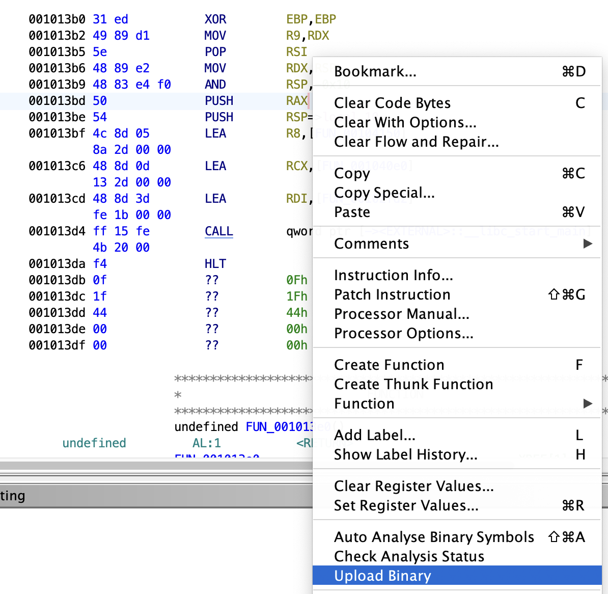

> We are using `fdupes` with symbols to allow the model to learn what these functions look like, and to provide meaningful labels that we can use later to rename similar binaries.

You can check the status of your request by selecting `Check Analysis Status` from either of the menus like before.

We now have uploaded fdupes to our dataset, meaning we can now use it for our binary similarity tasks. Lets see how this works on a stripped version of fdupes.

Import `src/test/resourcesfdupes.stripped` using the same steps as before. Once this has been completed, you can move on to the next step.

With fdupes.stripped open in Ghidra, select a funtion in Ghidra's listing view, and `right-click -> Rename from Similar Functions`, or `CTRL-Shift + R`. This will open the function renaming window.

> Note that you need to select the start of the function in order for this menu-item to appear in the right context.

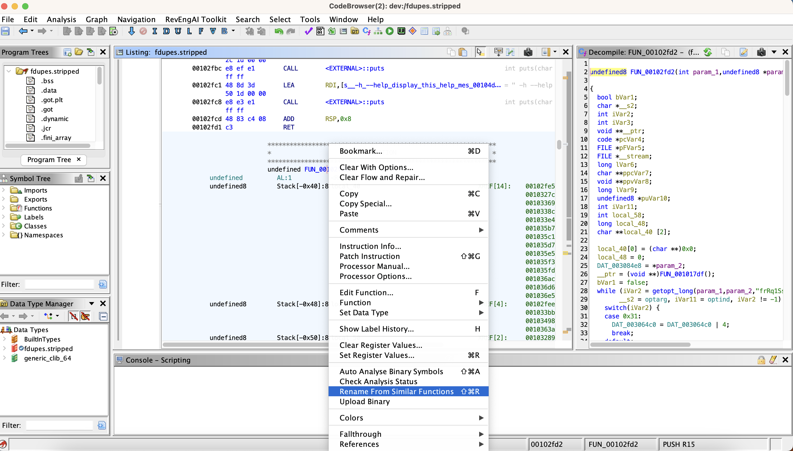
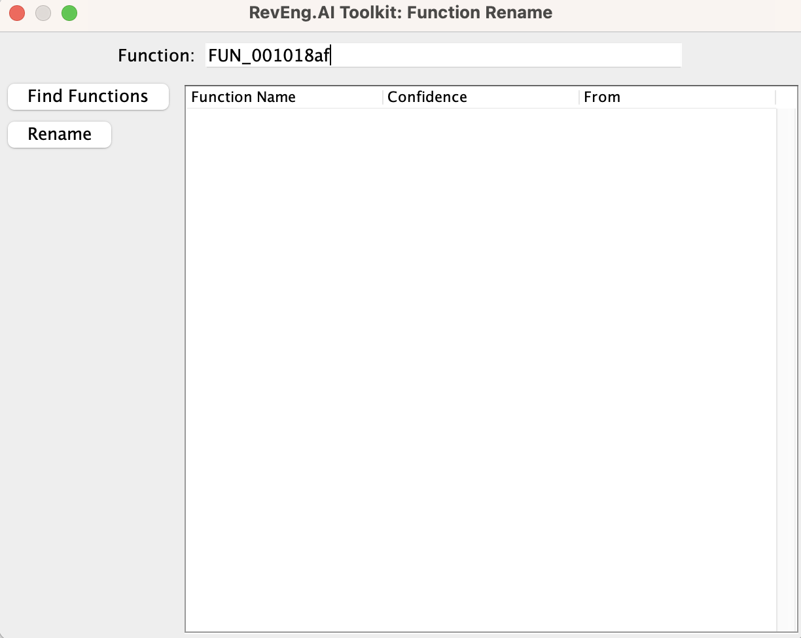

The list of functions is returned and displayed inside this panel for you.

You can then click `Refresh` to update the returned functions based on updated parameters.

### Auto Analysis

You can also batch analyse the binary to rename functions using the `Auto Analyse` tool.

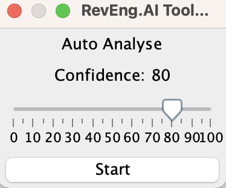

This tool pull the list of collections you have access to on your account, and allows you to specify which collections you want to be included in your auto analysis by clicking on the checkbox. Selecting no collections will enable all of the available collections in your search.

Move the slider to determine the confidence level you want to use for batch renaming. Any function returned that is higher than this value will automatically be renamed in the listing view. Clicking the `start` button will kick-off the analysis, which you can track in the blue progress bar

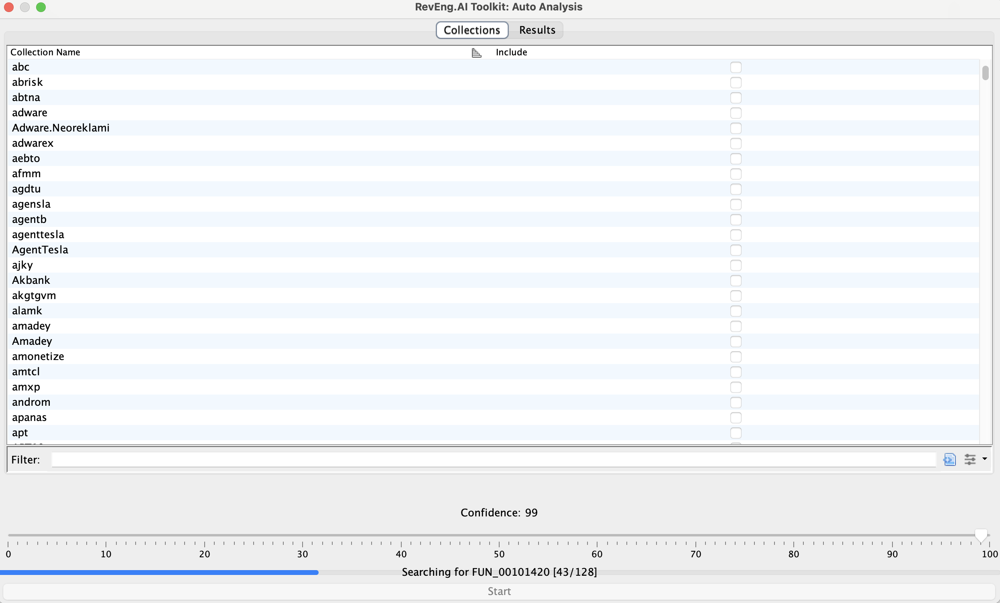

Once the analysis is complete, the results panel is enabled.
This provides information on what symbols have been renamed, and to what, along with a message explaining why the change occured.

> Skipped analyses refer to external functions that are not defined in the current binary, and therefore we cannot access the function representation from within the current binary.

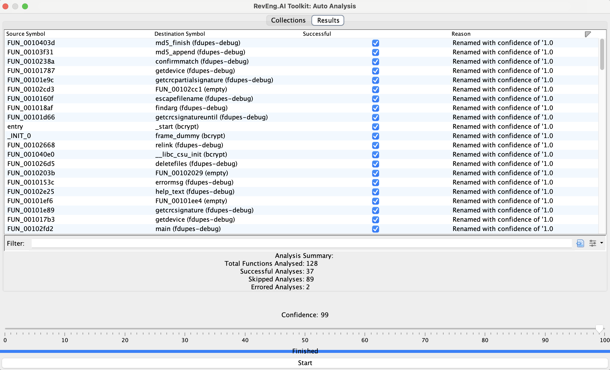

### Function Explaination

You can also use the plugin to generate a function comment that can be useful for explaining what the function is doing.

Select the function you are interested in, and from the `decompiler` view select `Explain This Function` from the right-click menu.

> You will need to have the `FunctionExplanationPlugin` enabled

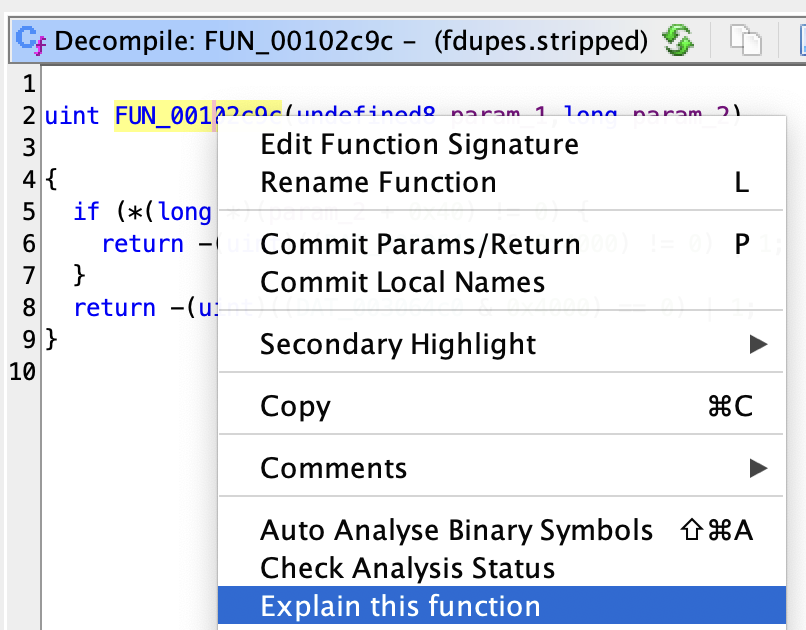

If we call this on a function for which we cannot recover symbols, in this example `FUN_00102c9c`, we get the following:

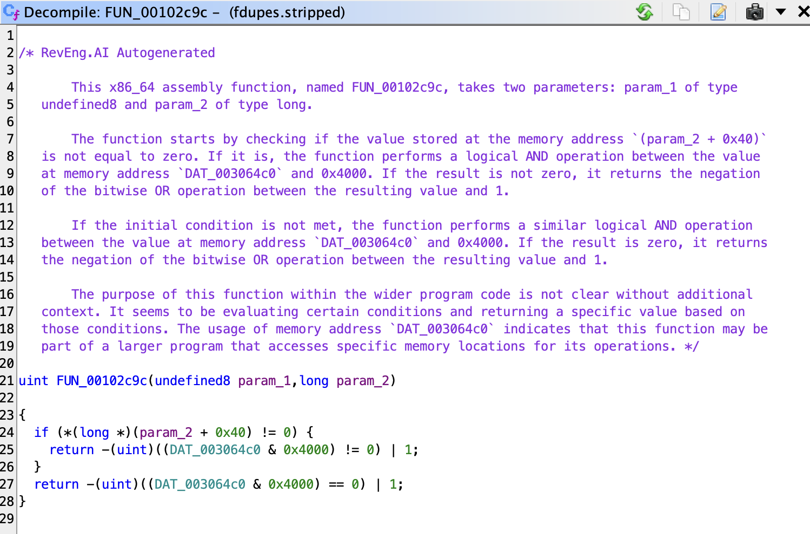

## Contributing

We welcome pull requests from the community.

### Code Overview

We have tried to decompose the plugin into a series of individual plugins dependent on a **CorePlugin**.

The **CorePlugin** provides services that are shared across all parts of the toolkit, namely configuration and API Services.

You should therefore group related features into a Feature Plugin, and then aquire services from the CorePlugin as required. This gives users the flexiblity to enable / disable features based on their use-case and/or preferences.

### Building

Gradle can be used to build REAIT from its source code.

#### No Eclipse

1. Clone the REAIT for Ghidra GitHub repository.
   ```
   git clone https://github.com/RevEngAI/reait-ghidra.git
   ```

2. Enter the repository and build with gradle.
   ```
   cd reait-ghidra
   gradle -PGHIDRA_INSTALL_DIR=<ghidra_install_dir>
   ```
   * Replace `<ghidra_install_dir>` with the path to your local Ghidra installation path.

3. After building, the plugin ZIP file will be located in the `dist/` folder.

#### Using Eclipse

Developing in Eclipse is the prefered method, but it does require some setup on the developers part, below is a (non-exhaustive) summary of what you need to do.

1. Import the project into Eclipse
2. Under **Preferences -> Gradle**
   - Add a Program Argument: `-PGHIDRA_INSTALL_DIR=PATH2GHIDRA`
3. Link you project with Ghidra using GhidraDev
4. Update your classpath to point at `jar`'s in `lib/`
   - Again this can be found in your project `preferences`

### Reporting Bugs

If you've found a bug in reait-ghidra, please open an issue via [GitHub](https://github.com/RevEngAi/reait-ghidra/issues/new/choose), or create a post on our [Community Forms](https://community.reveng.ai/c/integrations/ghidra/6).

#### Known Issues

_Plugin configuration is not appearing after installation:_

Check that the downloaded folder is called `reai-ghidra` and not `reai-ghidra-2` due to multiple downloads of the same folder.

## Credits
