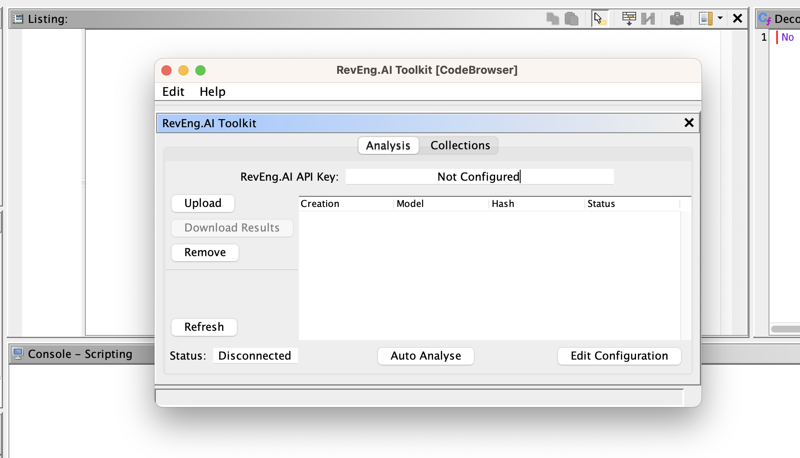
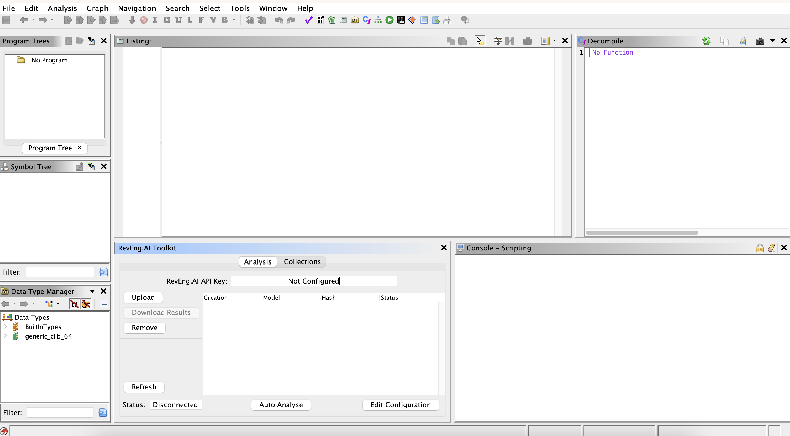
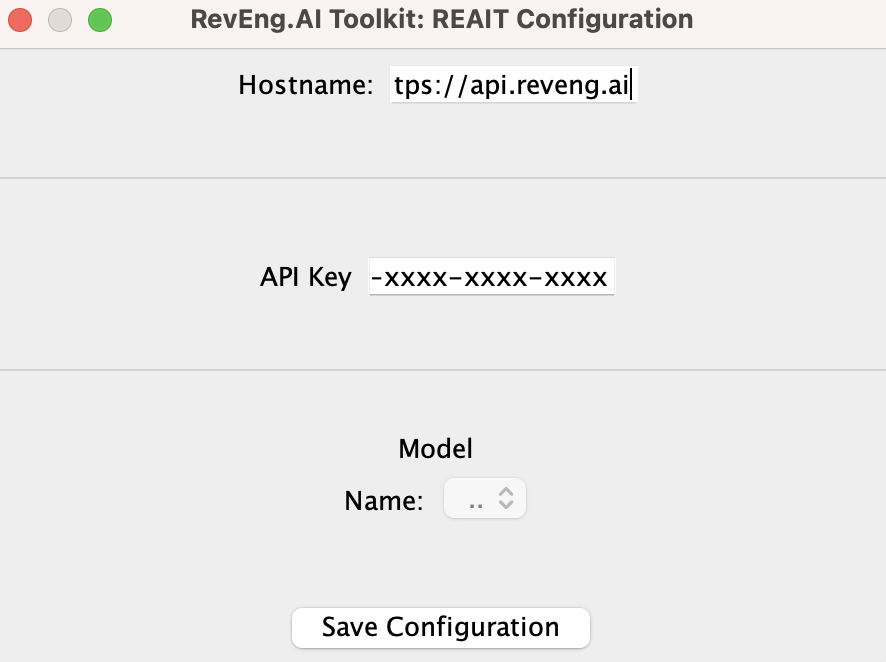
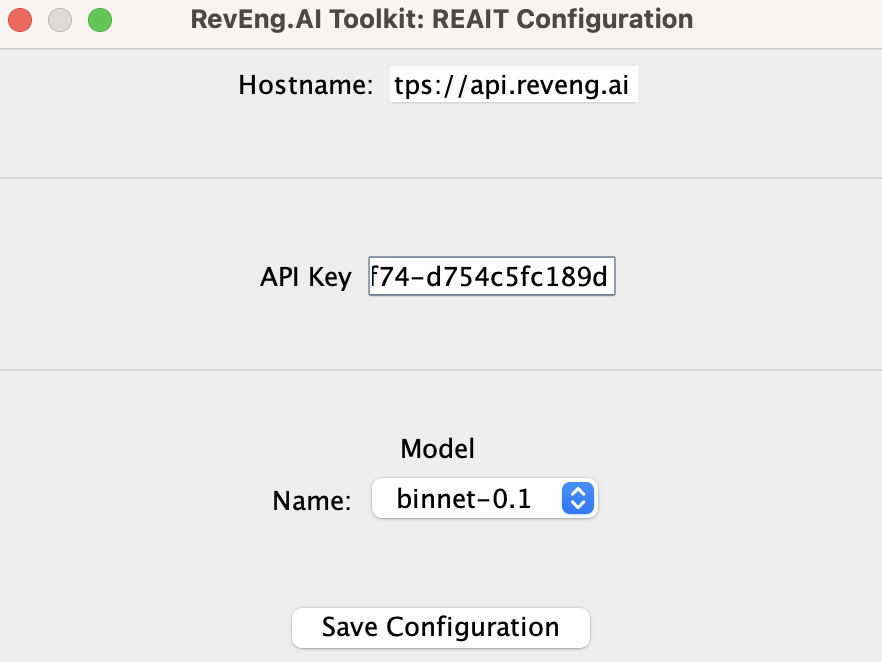
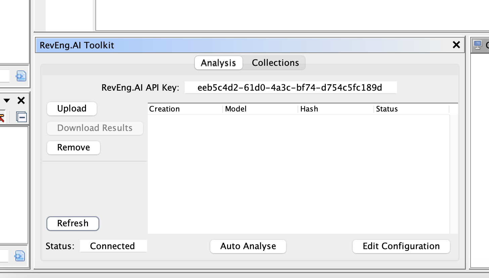
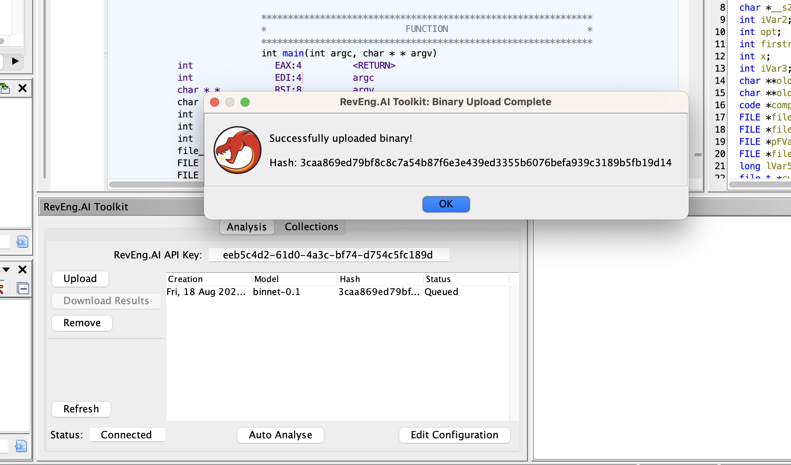
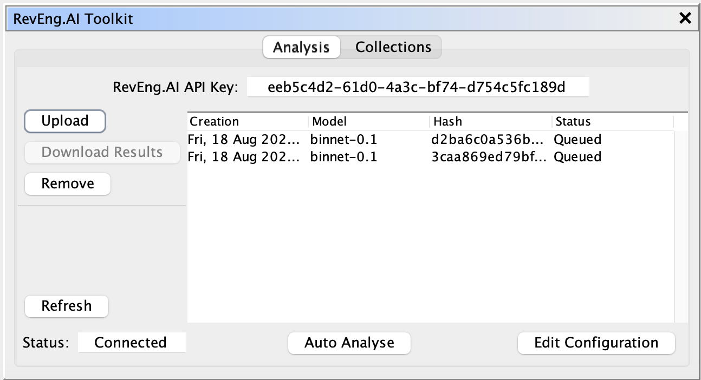

# RevEng.AI Ghidra Plugin

### AI Assisted Binary Analysis

Released as open source by Binary AI Ltd - https://reveng.ai

Released under the Apache 2.0 license (see [LICENSE](LICENSE) for more information)


## Description

The RevEng.AI Toolkit allows you to interact with our API from within Ghidra. This allows you to upload your currently open binary for analysis, and use it for Binary Code Simularity to help you Reverse Engineer stripped binaries.

## Table of Contents

- [Key Features](#key-features)
- [Installation](#installation)
  - [Loading the Plugin](#loading-the-plugin)
- [Usage](#usage)
- [Contributing](#contributing)
  - [Building from Source](#building-from-source)
  - [Reporting Bugs](#reporting-bugs)
- [Credits](#credits)

## Key Features

* Upload the current binary for analysis
* Manage you analyses locally from ghidra
* Rename a function based on similar functions in our dataset

## Installation

The latest stable version of REAIT can be downloaded from the [Releases](https://github.com/revengai/reait-ghidra/releases/latest) page.

### Loading the Plugin

1. Launch Ghidra.
2. Navigate to the Install Extensions window.
   * `File` -> `Install Extensions...`
3. Click the green "+" icon at the top-right corner.
4. Select the downloaded ZIP file to load the plugin into Ghidra.
5. Click the "OK" button to exit the Install Extensions window.
6. Restart Ghidra when prompted.

### Enabling the Plugin

Once installed, you can enable the plugin via the `Configure` tool.

1. Navigate to Ghidra's Configure tool
   - `File` -> `Configure`
2. Click `Configure` under the `RevEng.AI` plugin group
3. Select the checkbox next to the `RE_AIToolkitPlugin`

## Usage

In this section, we provide an example workflow for our plugin that uses test binaries from `src/test/resources/test-bins`.

Once the plugin is loaded, there will be additional controls in the CodeBrowser window.
You can access these Under `Wndows->RevEng.AI Toolkit`.
This opens the main Toolkit GUI.



You can "_dock_" this window within the Ghidra Program Tool to suit your preference, we like docking the window as below

.

The first thing we need to do is configure the tool with our API key and the desired "model"
- Each **model** defines a different set of features you want the AI to find in you binary.

Click the `Edit Configuration` button to open the configuration window.



When you open this window you will notice that the model name is disabled. To enable it, you need to enter your API Key from the [RevEng.AI Portal](https://portal.reveng.ai/settings) into the API Key field. Enter you API key and `press <ENTER>`. This will contact the API and display a list of models available to your account.

.

Clicking `Save Configuration` will create the `.reaiconf.toml` file in you systems home directory.

Close the configuration window and click `Refresh` to update the main GUI.

.

You are now ready to upload a binary.

Import `src/test/resources/test-bins/fdupes` into Ghidra and then click `Upload` in the toolkit GUI. This will update the analysis table with the hash, model, and status of you Binary in the RevEng.AI server. After you click upload, the plugin uploads your binary and returns the hash for the file. We store the hash as it is used as a parameter for all future requests concerning this file.

We are using `fdupes` with symbols to allow the model to learn what these functions look like, and to provide meaningful labels that we can use later to rename similar binaries.



We can see in the analysis table that our binary is now `Queued` for processing. You can update this status by clicking `Refresh` to fetch the latest status of your request.

We now have uploaded fdupes to our dataset, meaning we can now use it for our binary similarity tasks. Lets see how this works on a stripped version of fdupes.

Import `src/test/resources/test-bins/fdupes.stripped` using the same steps as before. You will now have two files in the analysis table.

.

Once the stripped binary is processed (`Status` will be `Complete`), select it in the analysis table and the `Download Results` button will be enabled. The plugin will then download your analysis results and store them in the `.reai` folder in you home directory. We can now use these results to query our dataset.

Select a funtion in Ghidra's listing view, and `right-click -> Rename from Similar Functions`. This will open the function renaming window.


Click on `Find similar functions` to queue RevEng.AI for functions in the dataset that appear similar. The list of functions is returned and displayed inside this panel for you.
You can then click `rename` to update the function name.

You can also batch analyse the binary to rename functions using the `Auto Analyse` tool.

![Auto Analyse Tool][]

Move the slider to determine the confidence level you want to use for batch renaming. Any function returned that is higher than this value will automatically be renamed in the listing view.

## Contributing

### Building from Source

Gradle can be used to build REAIT from its source code.

1. Clone the REAIT for Ghidra GitHub repository.
   ```
   $ git clone https://github.com/RevEngAI/reait-ghidra.git
   ```

2. Enter the repository and build with gradle.
   ```
   $ cd reait-ghidra
   $ gradle -PGHIDRA_INSTALL_DIR=<ghidra_install_dir>
   ```
   * Replace `<ghidra_install_dir>` with the path to your local Ghidra installation path.

3. After building, the plugin ZIP file will be located in the `dist/` folder.

### Reporting Bugs

If you've found a bug in reait-ghidra, please open an issue via [GitHub](https://github.com/RevEngAi/reait-ghidra/issues/new/choose).

## Credits
