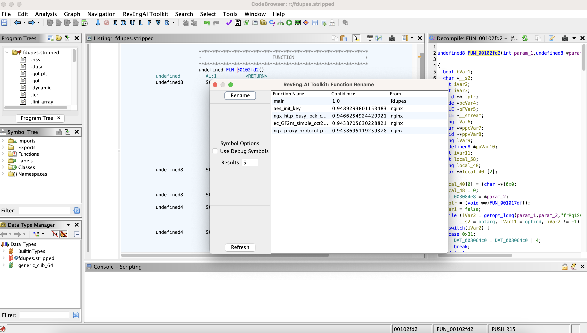

# RevEng.AI Ghidra Plugin

### AI Assisted Binary Analysis

Released as open source by Binary AI Ltd - https://reveng.ai

Released under the Apache 2.0 license (see [LICENSE](LICENSE) for more information)



## Description

The RevEng.AI Toolkit allows you to interact with our API from within Ghidra. This allows you to upload your currently open binary for analysis, and use it for Binary Code Simularity to help you Reverse Engineer stripped binaries.

## Table of Contents

- [Key Features](#key-features)
- [Installation](#installation)
  - [Loading the Plugin](#loading-the-plugin)
- [Usage](#usage)
- [Contributing](#contributing)
  - [Building from Source](#building-from-source)
  - [Reporting Bugs](#reporting-bugs)
- [Credits](#credits)

## Key Features

* Upload the current binary for analysis
* Manage you analyses locally from ghidra
* Rename a function based on similar functions in our dataset

## Installation

The latest stable version of REAIT can be downloaded from the [Releases](https://github.com/revengai/reait-ghidra/releases/latest) page.

### Loading the Plugin

1. Launch Ghidra.
2. Navigate to the Install Extensions window.
   * `File` -> `Install Extensions...`
3. Click the green "+" icon at the top-right corner.
4. Select the downloaded ZIP file to load the plugin into Ghidra.
5. Click the "OK" button to exit the Install Extensions window.
6. Restart Ghidra when prompted.

## Usage

Once the plugin is loaded, there will be additional controls in the CodeBrowser window.

## Contributing

### Building from Source

Gradle can be used to build REAIT from its source code.

1. Clone the REAIT for Ghidra GitHub repository.
   ```
   $ git clone https://github.com/RevEngAI/reait-ghidra.git
   ```

2. Enter the repository and build with gradle.
   ```
   $ cd reait-ghidra
   $ gradle -PGHIDRA_INSTALL_DIR=<ghidra_install_dir>
   ```
   * Replace `<ghidra_install_dir>` with the path to your local Ghidra installation path.

3. After building, the plugin ZIP file will be located in the `dist/` folder.

### Reporting Bugs

If you've found a bug in reait-ghidra, please open an issue via [GitHub](https://github.com/RevEngAi/reait-ghidra/issues/new/choose).

## Credits
