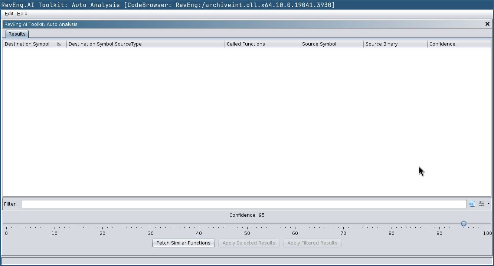
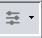
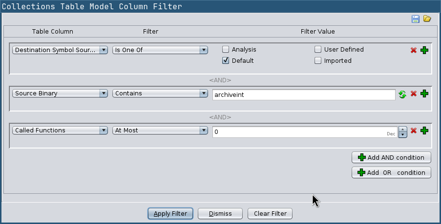

# RevEng.AI Ghidra Plugin

[Discord](https://discord.com/invite/ZwQTvzfSbA)

### AI Assisted Binary Analysis

Released as open source by RevEng.ai - https://reveng.ai

<!-- TODO -->
<!-- Released under the Apache 2.0 license (see [LICENSE](LICENSE) for more information) -->

## Description

The RevEng.AI Ghidra plugins allows you to interact with our API from within Ghidra.
This allows you to upload your currently open binary for analysis,
and use it for Binary Code Similarity to help you Reverse Engineer stripped binaries.

## Table of Contents

- [Key Features](#key-features)
- [Installation](#installation)
  - [Loading the Plugin](#loading-the-plugin)
  - [Enabling the Plugin](#enabling-the-plugin)
- [Usage](#usage)
   - [Auto Analysis](#auto-analysis)
   - [Function Explaination](#function-explaination)
- [Contributing](#contributing)
  - [Building from Source](#building-from-source)
  - [Reporting Bugs](#reporting-bugs)
    - [Known Issues](#known-issues)
- [Credits](#credits)

## Key Features

* Upload the current binary for analysis
* Automatically rename all functions above a confidence threshold
* Show similar functions and their names for one selected function

## Installation

The builds for latest stable version of the RevEng.AI Ghidra plugin for common Ghidra versions can be downloaded from the [Releases](https://github.com/revengai/reait-ghidra/releases/latest) page.

### Supported Ghidra Versions

We support all versions compatible with Ghidra 11.2+ based on Java 21.

#### Building your own Plugin (For custom Ghidra Forks and Versions)

If you are using a custom version of Ghidra (e.g. nightly builds), then you need to build your own version of the plugin against it,
otherwise Ghidra complains about a version mismatch when trying to install the plugin.
You can do this via `./gradlew -PGHIDRA_INSTALL_DIR=/opt/ghidra buildExtension`, and then use the zip from the `dist/` folder.

### Loading the Plugin

1. Launch Ghidra.
2. Navigate to the `Install Extensions` window.
   * `File` -> `Install Extensions...`
3. Click the green "+" icon in the top-right corner.
4. Select the downloaded ZIP file to load the plugin into Ghidra.
5. Click the "OK" button to exit the `Install Extensions` window.
6. Restart Ghidra when prompted.

### Enabling the Plugin

Once installed, you can enable the plugin via the `Configure` tool.

1. Navigate to Ghidra's Configure tool
   - `File` -> `Configure`
2. Click `Configure` under the `RevEng.AI` plugin group
3. Select the checkbox next to each of the plugins except the `DevPlugin` (unless you are doing development on the plugin itself)


## Usage

In this section, we provide an example workflow for our plugin that uses test binaries from `src/test/resources`.

Once the plugin is loaded, there will be additional controls in the toolbar under `RevEng.AI`.

### Configuration

The first thing we need to do is configure the plugin with our API key and the host to use.

When you load the plugin for the first time, or by selecting `RevEng.AI -> Configure`, you will be guided through the configuration process.


> Enter your API Key from the [RevEng.AI Portal](https://portal.reveng.ai/settings) into the API Key field
> where they will be validated and saved for future use.


### Running an Analysis

You are now ready to analyse a binary.

Import `src/test/resources/fdupes` into Ghidra and then create a new RevEng analysis, by going to `RevEng.AI -> Analysis -> Create New`.
Usually it's enough to use the default options, but you can also select specific platforms or architectures if you want to.


> We are using `fdupes` with symbols to allow the model to learn what these functions look like, and to provide meaningful labels that we can use later to rename similar binaries.

You can check the status of your request by selecting `RevEng.AI -> Analysis -> Check status` from the same menu.
Starting an analysis also triggers a background Ghidra thread that will periodically check the status
and pop a notification when the analysis is complete.

We now have uploaded `fdupes` to our dataset, meaning we can now use it for our binary similarity tasks. Let's see how this works on a stripped version of fdupes.

Import `src/test/resourcesfdupes.stripped` using the same steps as before. Once this has been completed, you can move on to the next step.

With `fdupes.stripped` open in Ghidra, select a function in Ghidra's listing or decompiler view, and `right-click -> Rename from Similar Functions`, or `CTRL-Shift + R`.
This will open the function renaming window.


The list of functions is returned and displayed inside this panel for you.

You can then click `Refresh` to update the returned functions based on updated parameters.

### Auto Analysis

You can also batch analyse the binary to rename functions using the `Auto Analyse` tool.

[//]: # (![Auto Analyse Tool]&#40;screenshots/auto-analysis-gui.png&#41;)

[//]: # (This tool pull the list of collections you have access to on your account, and allows you to specify which collections you want to be included in your auto analysis by clicking on the checkbox. Selecting no collections will enable all the available collections in your search.)

Move the slider to determine the confidence level you want to use for batch renaming. Any function returned that is higher than this value will automatically be renamed in the listing view. Clicking the `start` button will kick off the analysis, which you can track in the blue progress bar

[//]: # (![Auto Analysis Progress]&#40;screenshots/auto-analysis-gui-run.png&#41;)

Use `Fetch Similar Functions` to load matches from the API above the confidence threshold.



Once the results are retrieved, you can look at them more closely.
Each match is represented by a row in the table, and comes with various associated information
in each column. Not all of them are shown by default,
you can configure the displayed columns via the `Add/Remove Columns` entry in the context menu of a column.

You can now simply accept all displayed results via the `Apply Filtered Results` button,
or you can investigate them more closely yourself.

Ghidra comes with a powerful table including filtering and we integrate with this feature.
Double-clicking a table entry will open the corresponding function in the listing view.

You can search by strings in all matches,
or you can access the advanced filter options via the `Create Column Filter` button:



[//]: # (![Auto Analyse Result]&#40;screenshots/auto-analysis-results.png&#41;)

Here you can now set up more complex filters,
e.g. if you only want to apply matches that satisfy certain criteria.



After you apply the filter, the `Apply Filtered Results` button will only apply the matches that satisfy the filter.


Alternatively, you can select individual entries via `Ctrl+Click` and `Shift+Click` and apply only those via the
`Apply Selected Results` button.

## Contributing

We welcome pull requests from the community.

The plugin is still undergoing active development currently, and we are looking for feedback on how to improve the plugin.


### Code Overview

We have tried to decompose the plugin into a series of individual plugins dependent on a **CorePlugin**.

The **CorePlugin** provides services that are shared across all parts of the toolkit, namely configuration and API Services.

You should therefore group related features into a Feature Plugin, and then acquire services from the CorePlugin as required. This gives users the flexiblity to enable / disable features based on their use-case and/or preferences.

### Building

Gradle can be used to build REAIT from its source code.

#### No Eclipse

1. Clone the REAIT for Ghidra GitHub repository.
   ```
   git clone https://github.com/RevEngAI/reait-ghidra.git
   ```

2. Enter the repository and build with gradle.
   ```
   cd reait-ghidra
   gradle -PGHIDRA_INSTALL_DIR=<ghidra_install_dir>
   ```
   * Replace `<ghidra_install_dir>` with the path to your local Ghidra installation path.

3. After building, the plugin ZIP file will be located in the `dist/` folder.

#### Using Eclipse

Developing in Eclipse is the prefered method, but it does require some setup on the developers part, below is a (non-exhaustive) summary of what you need to do.

1. Import the project into Eclipse
2. Under **Preferences -> Gradle**
   - Add a Program Argument: `-PGHIDRA_INSTALL_DIR=PATH2GHIDRA`
3. Link you project with Ghidra using GhidraDev
4. Update your classpath to point at `jar`'s in `lib/`
   - Again this can be found in your project `preferences`

### Reporting Bugs

If you've found a bug in reait-ghidra, please open an issue via [GitHub](https://github.com/RevEngAi/reait-ghidra/issues/new/choose), or create a post on our [Community Forms](https://community.reveng.ai/c/integrations/ghidra/6).

#### Known Issues

_Plugin configuration is not appearing after installation:_

Check that the downloaded folder is called `reai-ghidra` and not `reai-ghidra-2` due to multiple downloads of the same folder.

## Credits
